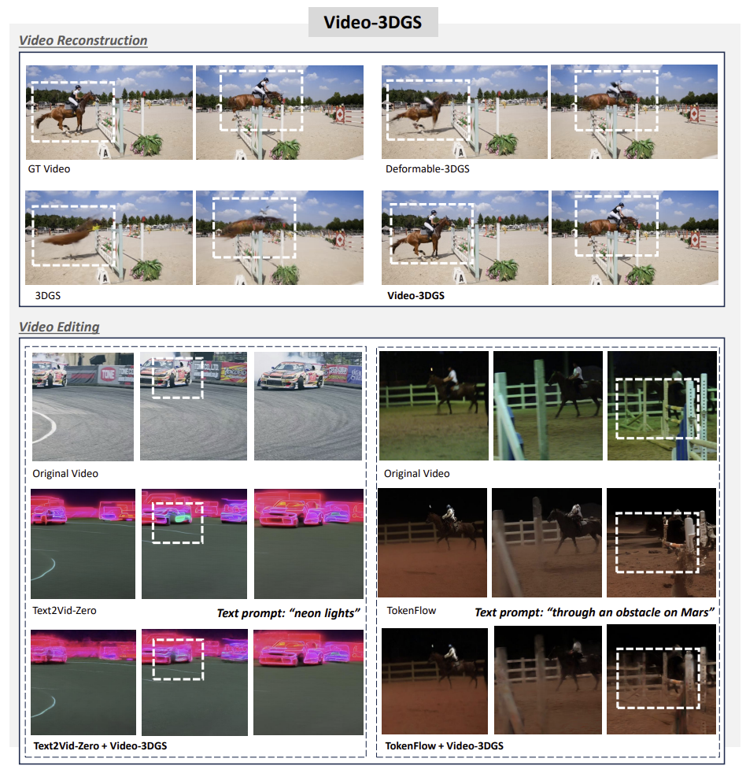
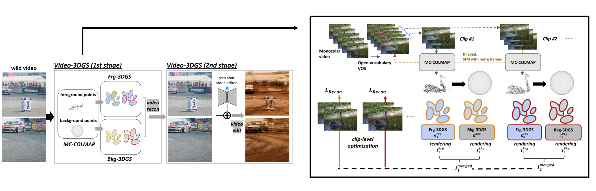

# Enhancing Temporal Consistency in Video Editing by Reconstructing Videos with 3D Gaussian Splatting
## [Project page](https://video-3dgs-project.github.io/) | [Paper]()


This repository contains the official Pytorch implementation of the paper "Enhancing Temporal Consistency in Video Editing by Reconstructing Videos with 3D Gaussian Splatting".


## Dataset

According to our paper, we conducted two tasks with the following datasets.

- Video reconstruction: [DAVIS](https://davischallenge.org/davis2017/code.html) dataset (480x854)
- Video editing: [LOVEU-TGVE-2023](https://github.com/showlab/loveu-tgve-2023?tab=readme-ov-file) dataset (480x480)

There are two options for pre-processing the datasets.
1. You can download the datasets with above link for original dataset and run MC-COLMAP.
2. You directly download MC-COLMAP processed dataset from [here](https://drive.google.com/drive/folders/1uYmLWUn5veBlUES88-9NKgNibiHxhe_F) 

We organize the datasets as follows:

```shell
├── datasets
│   | recon
│     ├── DAVIS
│       ├── JPEGImages 
│         ├── 480p
│           ├── blackswan
│           ├── blackswan_pts_camera_from_deva
│           ├── ...
│   | edit


```

## Pipeline




## Environments
Setting up environments for training contains three parts:

1.  Download [COLMAP](https://github.com/colmap/colmap) and put it under "submodules".
2.  Download [Tiny-cuda-nn](https://github.com/NVlabs/tiny-cuda-nn) and put it under "submodules".

```shell
git clone https://github.com/dlsrbgg33/Video-3DGS.git --recursive
cd Video-3DGS

conda create -n video_3dgs python=3.8
conda activate video_3dgs

# install pytorch
pip install torch==1.12.1+cu113 torchvision==0.13.1+cu113 torchaudio==0.12.1 --extra-index-url https://download.pytorch.org/whl/cu113

# install packages & dependencies
bash requirement.sh
```

Setting up environments for evaluation contains two parts:

1. download the pre-trained optical flow models (WarpSSIM)

```shells
cd models/optical_flow/RAFT
bash download_models.sh
unzip models.zip
```

2. download CLIP pre-trained models (CLIPScore, Qedit)

```shells
cd models/clipscore
git lfs install
git clone https://huggingface.co/openai/clip-vit-large-patch14
git clone https://huggingface.co/laion/CLIP-ViT-H-14-laion2B-s32B-b79K
```

## Video-3DGS (1st stage): Video Reconstruction

```shell
bash sh_recon/davis.sh
```

To effectively obtain reprentation for video editing, we utilize all the training images for each video scene in this stage.

Arguments:
  - iteration num
  - group size
  - number of random points

https://github.com/user-attachments/assets/8eb8e201-ef3b-461c-985b-72d3fa19cd54?width=100&height=100

- Video reconstruction for "drift-turn" in DAVIS dataset

## Video-3DGS (2nd stage): Video Editing
```shell
bash sh_edit/{initial_editor}/{dataset}.sh
```
We currently support three "initial editors": [Text2Video-Zero](https://github.com/Picsart-AI-Research/Text2Video-Zero) / [TokenFlow](https://github.com/omerbt/TokenFlow) / [RAVE](https://rave-video.github.io/)

We recommend user to install related packages and modules of above initial editors in Video-3DGS framework to conduct initial video editing.

For running TokenFlow efficiently (e.g., edit long video), we borrowed the some strategies from [here](https://github.com/eps696/SDfu).

https://github.com/user-attachments/assets/923dec4a-fb23-4c02-a187-a51cb57501a8?width=100&height=100

- Singe-phase refiner for "Text2Video-Zero" editor

## Video-3DGS (2nd stage) + Recursive and Ensembled refinement
```shell
bash sh_edit/{initial_editor}/davis_re.sh
```
https://github.com/user-attachments/assets/866d241c-8d63-4d49-9657-9b02737e9c40?width=100&height=100

- Recursive and ensembled refiner for "Text2Video-Zero" editor

## 📖BibTeX
If you find this code helpful in your research or wish to refer to the baseline
results, please use the following BibTeX entry.

```
@article{shin2024enhancing,
  title={Enhancing Temporal Consistency in Video Editing by Reconstructing Videos with 3D Gaussian Splatting},
  author={Shin, Inkyu and Yu, Qihang and Shen, Xiaohui and Kweon, In So and Yoon, Kuk-Jin and Chen, Liang-Chieh},
  journal={arXiv preprint arXiv:2406.02541},
  year={2024}
}
```


## 🤗Acknowledgements
- Thanks to [3DGS](https://repo-sam.inria.fr/fungraph/3d-gaussian-splatting/) for providing codebase of 3D Gaussian Splatting.
- Thanks to [Deformable-3DGS](https://github.com/ingra14m/Deformable-3D-Gaussians) for providing codebase of deformable model.
- Thanks to [Text2Video-Zero](https://github.com/Picsart-AI-Research/Text2Video-Zero), [TokenFlow](https://github.com/omerbt/TokenFlow) and [RAVE](https://rave-video.github.io/) for providing codebase of zero-shot video editors.
- Thanks to [RAFT](https://github.com/princeton-vl/RAFT) and [CLIP](https://huggingface.co/laion/CLIP-ViT-H-14-laion2B-s32B-b79K) for providing evaluation metric codebase.

